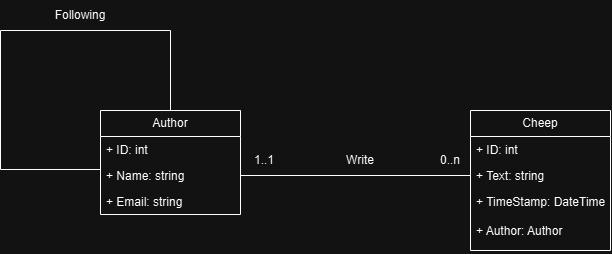
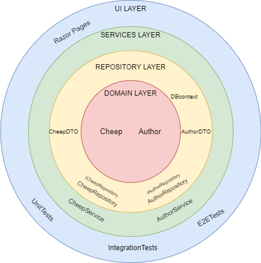

# Design and Architecture of _Chirp!_

## Domain model

Here comes a description of our domain model. ( this is just template stuff for now)

## Architecture — In the small

## Architecture of deployed application

## User activities

## Sequence of functionality/calls trough _Chirp!_

# Process

## Build, test, release, and deployment
For Chirp! we utilize three main github workflows. The first is an automated build and test workflow that attempts to build any commit or pull request.
It also runs our basic unit and integration tests, the more advanced test suite is not automated. For azure we have a standard azure deployment workflow with a minor change:
we have added an optional dispatch, and limited what triggers the workflow. As redeploying azure on trivial changes result in extensive downtime.
Our final Workflow "chirpflow" creates a release on versions with tags matching "v.*.*.*" this is mostly used for punctiating feature implementations. The releases 
contains the program compiled for windows, linux, osx, and arm-64.
## Team work

## How to make _Chirp!_ work locally

## How to run test suite locally

# Ethics

## License
This project is licensed under the MIT License (see full License her: https://github.com/ITU-BDSA2024-GROUP25/Chirp/blob/main/LICENSE).
In the document NOTICE.MD we have provided additional information about other Licenses and copyrights for packages used, that do not fall under MIT (see https://github.com/ITU-BDSA2024-GROUP25/Chirp/blob/main/NOTICE.md).
## LLMs, ChatGPT, CoPilot, and others
