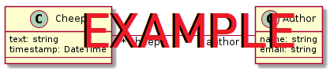
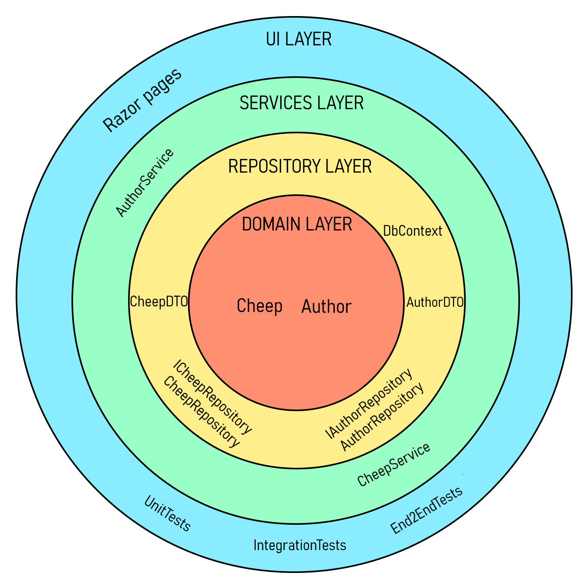

# Design and Architecture of _Chirp!_

## Domain model

Here comes a description of our domain model. ( this is just template stuff for now)

## Architecture — In the small

## Architecture of deployed application

## User activities

## Sequence of functionality/calls trough _Chirp!_

# Process

## Build, test, release, and deployment

## Team work

## How to make _Chirp!_ work locally

## How to run test suite locally

# Ethics

## License

## LLMs, ChatGPT, CoPilot, and others
