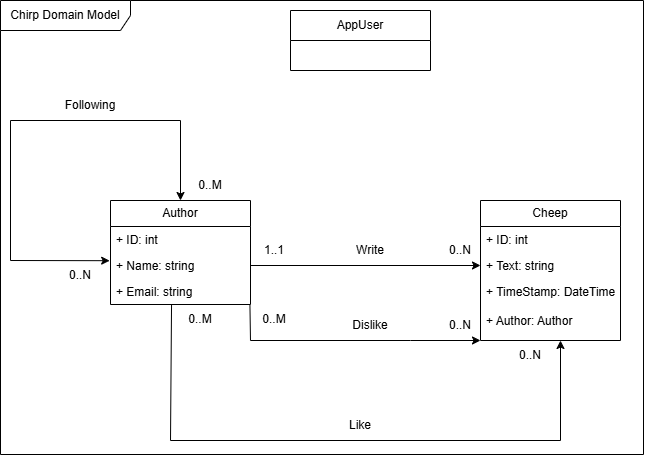
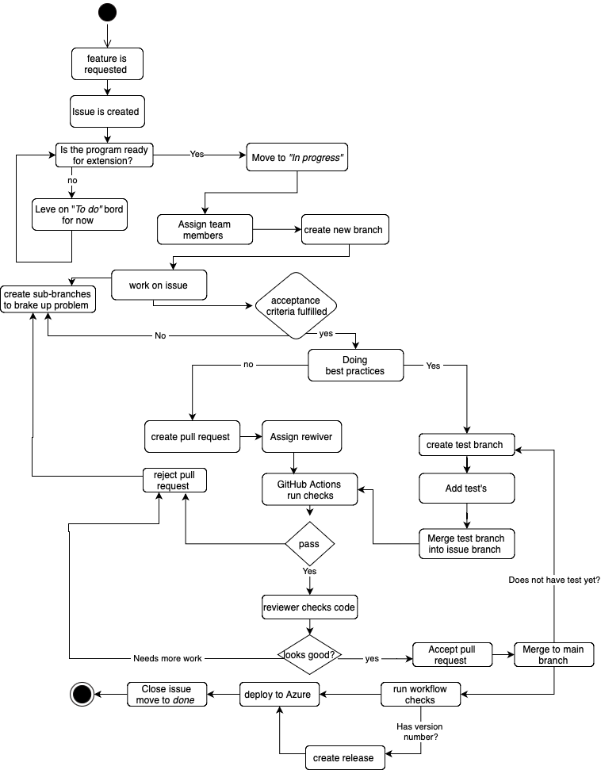

# Design and Architecture of _Chirp!_

## Domain model

Here comes a description of our domain model. 

## Architecture — In the small
Our chirp application uses onion architecture, as such our application Consists of three layers,
The core layer, where our basic data types and interfaces are made. The infrastructure layer
Where most of our functions and interactions are defined. and the web layer, where everything is brough together with
dependency injections in our razor pages and application builder. 

Note: this 4 layered onion diagram is not 1:1 to the actual structure. Chirp.infrastructure covers both the
repository and services layer in our 3 layer onion. And we have some interfaces and DTOs that are from chirp.core
But as we use them for transport, and to set up our repository we find they fit better in the repository layer, than the domain layer. 

(short version: Note: the 4 layer onion diagram uses different abstractions of layers and are not 1:1 with the internal programs 3 layers)

## Architecture of deployed application

## User activities

This illustration shows a potential user journey through the chirp application. Before login every possible user journey is represented. After login the illustration only display some of the options a user has. All functionalities are addressed at some point in the journey, but the illustration would become unreadable if it showed every possible way the user can go. For instance, it is both possible to logout and access the public timeline, no matter where the user is, so there would be a lot of crossing arrows.

## Sequence of functionality/calls trough _Chirp!_

# Process

## Build, test, release, and deployment
For Chirp! we utilize three main github workflows. The first is an automated build and test workflow that attempts to build any commit or pull request.
It also runs our basic unit and integration tests, the more advanced test suite is not automated. For azure we have a standard azure deployment workflow with a minor change:
we have added an optional dispatch, and limited what triggers the workflow. As redeploying azure on trivial changes result in extensive downtime.
Our final Workflow "chirpflow" creates a release on versions with tags matching "v.*.*.*" this is mostly used for punctiating feature implementations. The releases 
contains the program compiled for windows, linux, osx, and arm-64.

Build and test: very usefull, used to see if a pull request actually passes the tests!
Does not run our most advanced tests. ( could mention that due to the lateish introduction of tools like playwright
we did not quite find the expertise and time to justify not running these tests locally. with out small team it's
quite easy to get someone else to hop on the branch and run the test suite before a merge) But could defenetly be improved
by letting it know our secrets and setting playwright up. (though the playwright tests break on UI changes, and that's not really an incompatiblilty)

AzureDeploy: this one is generated by azure, it is modified to build the app from core outward, as azure has had some disagreements with the applications onion architecture. We also limited when it runs as a modification.
Extremly usefull. especially as the onion architecture disallows manual terminal deployment the way we did prior to the refactoring.

chirpflow: This workflow is not used frequently as it's for creating a release, this should be run for weekly evaluations, and major updates.

## Team work
### *** INSERT final picture of bord with unfinished tasks *** 
comment on the missing changes 

-- add comment on why playwrite does not run though workflows. 

### Introducing a new feature  
From the beginning the team agreed to, work together physically instead of remotely when ever possible, therfore a lot of task were undertaken using a combination of mob programming and co-authoring, this goes for tackling a new feature as well.

When presented with a new feature to implement, a team member creates a new issue on the project bord and adds appropriate acceptance criteria. If there is some confusion as to what that would be, the team member brings it to the team, discuss it, and create a plan for how to best approach the implementation. When a new feature is under development a team member moves it from the To-do list to the in progress list and assigns one or more members to the task.

When assigned to an issue, member(s) then create- and publish a new branch to work on the issue, occasionally creating sub-branches to try different approaches. Doing their best to keep to a GitHub Flow -style branching strategy.
When the acceptance criteria had been fulfilled, the member(s) working the branch - or someone else from the team, will then create a new sub-branch, to write the necessary test for the new methods and- or UI features.

Now the member(s) working on the issue creates a pull request to the branch, to merge it with main branch, and add a reviewer(s). Before another team member can merge preliminary workflow checks will be run, then if the new input passes workflow checks (see -- add ref to WF --) and test the reviewer can look at the code, reject if necessary, or complete the merge. The old branch can then be deleted.

https://github.com/ITU-BDSA2024-GROUP25/Chirp/blob/main/docs/images/from%20issue%20creation%20to%20merge.drawio.png

## How to make _Chirp!_ work locally

## How to run test suite locally

# Ethics

## License
This project is licensed under the MIT License (see full License her: https://github.com/ITU-BDSA2024-GROUP25/Chirp/blob/main/LICENSE).
In the document NOTICE.MD we have provided additional information about other Licenses and copyrights for packages used, that do not fall under MIT (see https://github.com/ITU-BDSA2024-GROUP25/Chirp/blob/main/NOTICE.md).

## LLMs, ChatGPT, CoPilot, and others
During the project, ChatGPT was used sparingly and was used when we encountered problems or situations where we felt stuck and documentation sites such as StackOverflow deemed unhelpful. Another use case of ChatGPT was to avoid redundant manual tasks, such as generating colors for the dark mode stylesheet. 
The code segments developed with the help of an LLM have been clearly commented as such.  

ChatGPT was used in the following areas:
* CSS styling for dark mode and switch button.
* Database structuring and help with schema relations.
* Complex JavaScript features like "Maintain scroll" and "Switch button for color themes".
  
Generally, the use of LLMs sped up the project progress, however, in a few instances they provided wrong or buggy solutions which required extra time debugging.