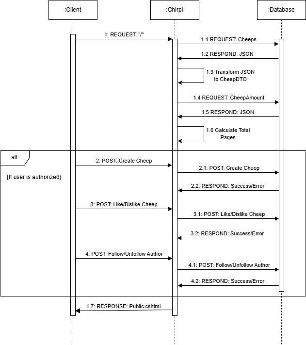
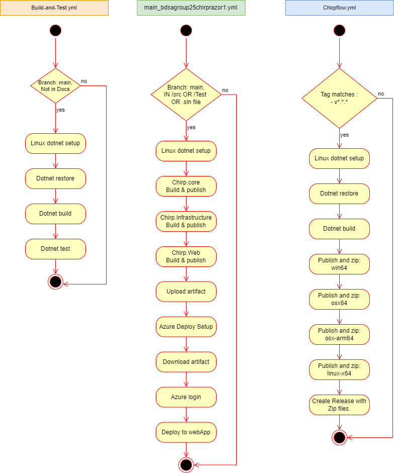
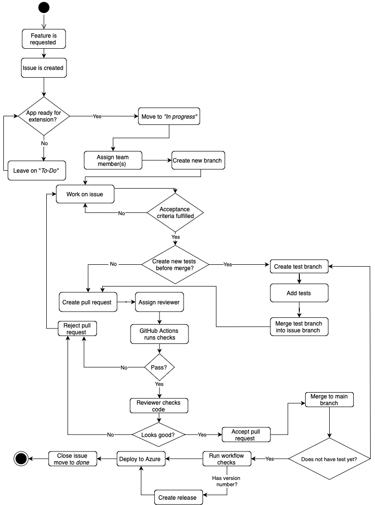

# Design and Architecture of _Chirp!_

## Domain model


## Architecture — In the small
Our Chirp! application uses onion architecture, as such our application consists of three layers. The core layer is where our basic data types and interfaces are defined. 
The infrastructure layer is where most of our functions and interactions are implemented and the web layer is where everything is brought together with
dependency injections in our razor pages and application builder. 

Note: This 4 layered onion diagram is not 1:1 to the actual onion structure of the code. Chirp.Infrastructure covers both the
repository and services layer in our 4-layer onion diagram. For instance, we have Data Transfer Objects(DTOs) that are from Chirp.Core which we use 
for transportation between layers, since they fit better in the repository layer than the domain layer in the diagram. 


## Architecture of deployed application


This is a visualization of our deployed program on our Azure application.

## User activities


This illustration shows a potential user's journey through the Chirp! application. Before login, every possible user journey is represented. 
After login, the illustration only displays the options linearly. All functionalities are addressed at some point in the journey,
but the illustration would become indecipherable if it showed every possible option at any time. For instance, it is possible to logout 
and access the public timeline, no matter where the user is.

## Sequence of functionality/calls through _Chirp!_


The illustration shows the sequence of events happening when the user opens the application. This sequence diagram is made at a 
relatively high level of abstraction, and as such focuses on important sequences where every single operation is not shown. 
For example, attributes such as ```Like-/DislikeAmount```, ```IsFollowing```, etc. are all retrieved as a part of the fetched objects from the request and shown accordingly. 

# Process

## Build, test, release, and deployment



**Build-and-test** is an automated build and test workflow that attempts to build and test any commit or pull request. The workflow is used to see if a pull request passes the tests. 
This workflow exclusively runs backend tests.

**main_bdsagroup25chirprazor1** is generated by Azure and is modified to build the app starting with Chirp.Core followed 
by Chirp.Infrastructure and lastly Chirp.Web. This is because Azure has difficulties supporting the application's onion architecture. 
The onion architecture disallows manual terminal deployment. There are limits on what triggers the workflow 
as redeploying Azure on trivial changes results in extensive downtime. There is an optional dispatch to trigger the workflow manually.

**Chirpflow** is not used frequently as it is used for creating a GitHub release. Chirpflow is semi-manual as it requires version tags, matching ```v.*.*.*```, 
to be run and should be run for weekly evaluations and major updates. The releases contain the program compiled for Windows, Linux, OSX, and OSX arm-64.

## Team work


### Introducing a new feature  
From the beginning the team agreed to, work together physically instead of remotely when ever possible, therefore a lot of task were undertaken using a combination of mob programming and co-authoring, this goes for tackling a new feature as well.

When presented with a new feature to implement, a team member(s) creates a new issue on the project bord and adds appropriate acceptance criteria. If there is some confusion as to what that would be, the team member(s) brings it to the team, discuss it, and create a plan for how to best approach the implementation. When a new feature is under development a team member moves it from the To-do list to the in progress list, and assigns one or more members to the task.

When assigned to an issue, member(s) then create - and publish a new branch to work on the issue, Doing their best to keep to a GitHub Flow -style branching strategy.
When the acceptance criteria  been fulfilled, the member(s) working the branch - or someone else from the team, will then create a new sub-branch, to write the necessary test for the new methods and- or UI features. 

Now the member(s) working on the issue, creates a pull request to the branch to merge it with main branch and add a reviewer(s), This will then trigger workflow checks, making sure that new features will not conflict with the current version of the program. (ref?) 

If the new feature passes the checks, the reviewer(s) can now manually look at the code, to check for possible conflicts that the workflows did not catch. 
The reviewer(s) can now approve( or reject) pull request and the old branch can be deleted.

*Above description is true to our process if the team had worked always using best practise. However it should be noted that do to a lot of uncertainty about how test should be written, a lot of the time new features would be committed to main, without test, which would then be added later.*     



### Unfinished features


We would have preferred to have implemented following features but simply did not have the time: 

**Get workflow to run UI test** Do to playwright being introduced later in the project, the team did not have the time or expertise to figure out how to make playwright and integration test run using GitHub Actions, Primarily do to being unable to make automatic SetUp / TearDown functions to work. 

**confirmation warning on critical actions** an example of a critical action could be; If a User wants to delete a cheep or delete their author page entity. This would trigger a pop-up window should then check with the user, if they confirm, the action will be done. otherwise the action is abandoned.

**The page not flashing in dark mode**  We currently have an issue when page is in dark mode where a page change will flash between dark and lightmode, This would give people with light sensitivity issues problems.

**Automation on project bord **  All updates to project bord are done manually this would have been an  ideal feature to run automatically though a workflow.   


## How to make _Chirp!_ work locally
Before attempting to run Chirp!, ensure that dotnet 8 is installed on your computer.
For the localhost version of the Chirp!, there are no other install requirements.

The program does however need two secrets present on your computer for it to run.
To add the secrets to your "secrets-storage" navigate your terminal to **"chirp/src/chirp.web/"** folder and 
use the following commands from the terminal:

``` dotnet user-secrets set "authentication:github:clientId" "SECRET-A" ```

``` dotnet user-secrets set "authentication:github:clientSecret" "SECRET-B ```

**Initializing the secret store should not be necessary. However, just in case the command is "dotnet user-secrets init"**

These are our localhost secrets and will enable GitHub login on Chirp!. This is required, as an exception is triggered if the GitHub secrets are missing.

Now Chirp! should be ready to run.

The Program must be run from the **chirp/src/chirp.web/** folder.
Either ``` dotnet run ```  or ``` dotnet Watch ```  will work.


## How to run the test suite locally
There are two different test suits. 
There are the backend tests that are primarily unit tests and do not use the UI. These tests can be run from the Chirp folder by running the command:  ```dotnet test```

There are also tests that are separate from the unit tests such as Playwright tests and front-end integration tests. These tests need to run on localhost with Playwright installed and secrets present on the computer.  

Step-by-step guide for front-end tests:  
  1. Open a terminal. Navigate to the Chirp/src/Chirp.Web folder
  2. Run the command ```dotnet run```
  3. Open a new terminal. Navigate to the Chirp/test
  4. Run the command ```dotnet test```

# Ethics

## License
This project is licensed under the MIT License (see full license here: https://github.com/ITU-BDSA2024-GROUP25/Chirp/blob/main/LICENSE).
In the document NOTICE.md we have provided additional information about other licenses and copyrights for packages used, that do not fall under MIT (see https://github.com/ITU-BDSA2024-GROUP25/Chirp/blob/main/NOTICE.md).

## LLMs, ChatGPT, CoPilot, and others
During the project, ChatGPT was used sparingly when we encountered problems or situations where we felt stuck and documentation sites such as StackOverflow were deemed unhelpful. Another use case of ChatGPT was to avoid redundant manual tasks, such as generating colors for the dark mode stylesheet. 
The few code segments developed with the help of an LLM have been clearly commented as such.  

ChatGPT was used in the following areas:
* CSS styling for dark mode and switch button.
* Database structuring and help with schema relations.
* Complex JavaScript features like "Maintain scroll" and "Switch button for color themes".
  
Generally, the use of LLMs sped up the project's progress. However, in a few instances, they provided wrong or buggy solutions which required extra time debugging.
